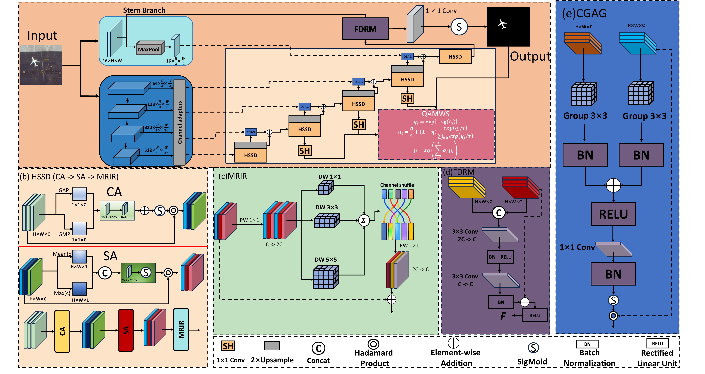
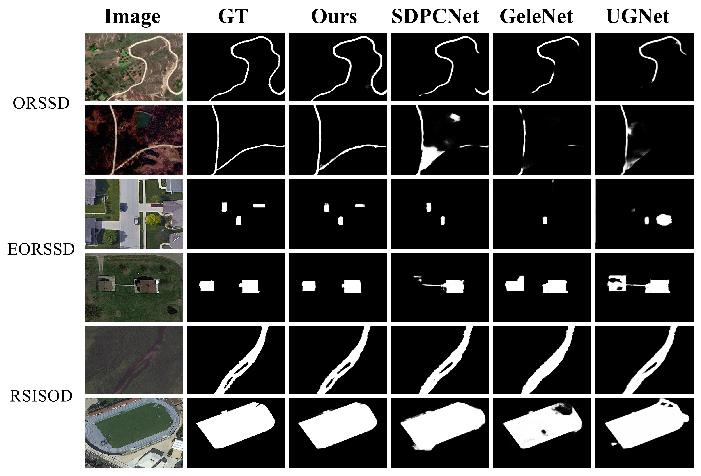
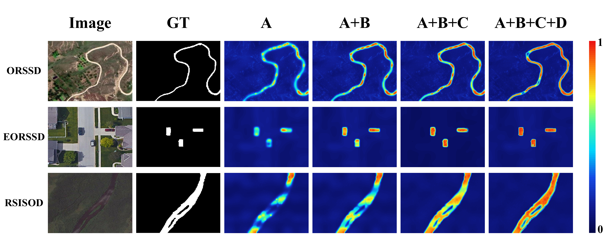
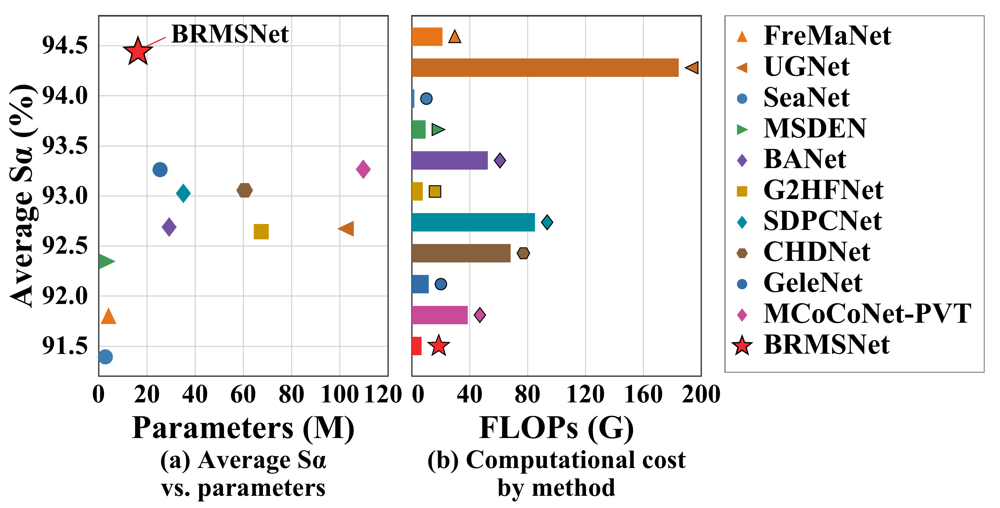

<div align="center">

# BRMSNet

### Remote Sensing Salient Object Detection

**Multi-scale feature fusion · Gated skip connections · Full-resolution detail refinement**


[Overview](#overview) &nbsp;·&nbsp; [Architecture](#method) &nbsp;·&nbsp; [Computational Cost](#results) &nbsp;·&nbsp; [Visualizations](#visualizations) &nbsp;·&nbsp; [Getting Started](#getting-started) &nbsp;·&nbsp; [Code Guide](#code-guide)

</div>

---

<a id="overview"></a>
## Overview

**BRMSNet** detects salient objects in remote sensing imagery and produces pixel-level saliency predictions. This repository includes the model, QAMWS multi-scale supervision, data loading, training, validation, testing, and result export.

The model combines a **PVTv2-B1 encoder, an HSSD decoder, CGAG skip connections, and an FDRM full-resolution refinement module**. Training uses four prediction heads; inference executes only the main head.

<table align="center">
  <tr>
    <th align="center">13.8219M</th>
    <th align="center">13.2354G</th>
    <th align="center">512 × 512</th>
  </tr>
  <tr>
    <td align="center">Parameters</td>
    <td align="center">MACs</td>
    <td align="center">Default Input Size</td>
  </tr>
</table>

<p align="center"><sub>Local CPU profiling of the current implementation using timm 1.0.30 and THOP. Detection accuracy requires training and evaluation on real datasets.</sub></p>

<a id="method"></a>
## Architecture

<p align="center">
  <a href="assets/figures/framework.pdf">
    
  </a>
</p>
<p align="center"><em>BRMSNet architecture with HSSD, MRIR, FDRM, and CGAG modules. Click the image to view the original PDF.</em></p>

| Component | Role | Implementation |
| :--- | :--- | :--- |
| **PVTv2-B1** | Extracts four levels of multi-scale features, which are adapted to the decoder channel widths. | [BRMSNet](models/pvt_mkunet.py) |
| **HSSD** | Restores spatial resolution through channel/spatial attention, multi-kernel inverted residual blocks, and progressive upsampling. | [Decoder](models/pvt_mkunet.py) |
| **CGAG** | Gates encoder skip features before adding them to the decoder features. | [GroupedAttentionGate](models/pvt_mkunet.py) |
| **FDRM** | Fuses full-resolution shallow features with decoder features to refine prediction details. | [FullResolutionRefinement](models/pvt_mkunet.py) |
| **QAMWS** | Weights the losses of four heads according to prediction quality and applies quality-gated mixture guidance. | [qamws.py](models/qamws.py) |

<details>
<summary><b>Multi-scale supervision and prediction interface</b></summary>

`model(images, return_all=True)` returns `[main, eighth, quarter, half]`, with all four logits aligned to the input resolution. By default, `model(images)` returns only `[main]` and does not execute the auxiliary prediction heads.

QAMWS has no learnable parameters. It first computes four segmentation losses for each image, then assigns weights using detached quality scores. The mixture target is formed in probability space. KL guidance is applied only when the mixture target has a lower segmentation loss than the receiving head. The first 10 epochs use uniform weights without mixture guidance.

The segmentation objective combines structure loss, boundary Dice loss, and Focal Tversky loss, excluding padded regions from the calculations.

</details>

<a id="results"></a>
## Computational Cost and Validation Status

| Item | Current Value or Status |
| :--- | :--- |
| Parameters | **13.8219M** |
| MACs | **13.2354G** |
| FLOPs | **26.4709G**, using `1 MAC = 2 FLOPs` |
| Profiling input | `1 × 3 × 512 × 512`, main-head inference |
| CPU checks | Computational profiling completed; training and evaluation entry points display their help messages successfully |
| Full dataset training and accuracy | Not yet verified |
| CUDA AMP | Requires validation in a GPU environment |

Run the following command to measure computational cost. The script uses randomly initialized weights and requires neither a dataset nor a pretrained weight download:

```bash
python profile_cpu.py
```

The repository includes an architecture diagram. The evaluation script exports prediction visualizations for real images to `predictions_rsod/`.

<a id="visualizations"></a>
## Visualizations

The following figures present visual results from the manuscript. Click any image to view the original PDF.

### Comparison with Other Methods

<p align="center">
  <a href="assets/figures/comparison.pdf">
    
  </a>
</p>
<p align="center"><em>Qualitative comparisons on ORSSD (rows 1–2), EORSSD (rows 3–4), and RSISOD (rows 5–6). GT denotes ground truth.</em></p>

### Cumulative Ablation Results

<p align="center">
  <a href="assets/figures/ablation.pdf">
    
  </a>
</p>
<p align="center"><em>From left to right after GT: the HSSD baseline, followed by cumulative additions of FDRM, CGAG, and QAMWS. The color bar ranges from 0 to 1.</em></p>

### Accuracy and Efficiency

<p align="center">
  <a href="assets/figures/efficiency_tradeoff.pdf">
    
  </a>
</p>
<p align="center"><em>Accuracy–efficiency comparison reported in the manuscript. BRMSNet is highlighted by a red star.</em></p>

This figure uses the manuscript measurements of **16.3M parameters and 15.5G FLOPs** for BRMSNet. They differ from the current implementation profiling reported above; the two sets of measurements have not yet been reconciled.

<a id="getting-started"></a>
## Getting Started

### 1. Installation

Clone the repository and create an environment with Python 3.9 or later:

```bash
git clone https://github.com/lumenworks0403/BRMSNet.git
cd BRMSNet
python -m venv .venv
```

Activate the environment:

```powershell
# Windows PowerShell
.\.venv\Scripts\Activate.ps1
```

```bash
# Linux / macOS
source .venv/bin/activate
```

Install a compatible PyTorch and torchvision pair for your device, then install the project dependencies:

```bash
python -m pip install -r requirements.txt
```

Training downloads pretrained encoder weights through timm by default, so the first run requires internet access. Use `--no-pretrained` to train from random initialization.

### 2. Prepare the Data

Prepare the dataset separately. The default directory layout for `ORSSD` is:

```text
data/rsod/ORSSD/
├── train/
│   ├── images/
│   └── masks/
├── val/                    # Optional
│   ├── images/
│   └── masks/
└── test/
    ├── images/
    └── masks/
```

Images and masks are paired by filename stem. To use a different location, set `--data-root` to the parent directory of `ORSSD/`.

<details>
<summary><b>Training/validation splits and input processing</b></summary>

If `val` is absent, a fixed 10% of `train` is held out using sample lists without moving files. If `val` exists, it is used directly, and training/validation overlap is checked. The test set is not used for split construction or checkpoint selection.

Images are resized while preserving their aspect ratio and padded to 512×512. Rotation, horizontal flipping, and vertical flipping each have a probability of 0.5 during training. An independent `--split-seed` controls the data split, which is shared across all runs.

</details>

### 3. Train

```bash
python train_rsod.py --dataset ORSSD --device cuda
```

For an initial run with a single seed:

```bash
python train_rsod.py --dataset ORSSD --device cuda --runs 1
```

| Default Setting | Value |
| :--- | :--- |
| Epochs / batch size | `200` / `8` |
| Initial learning rate: encoder / new layers | `3e-5` / `3e-4` |
| Optimizer / learning rate schedule | AdamW / cosine decay |
| Random seeds | `42`, `43`, and `44`; three runs by default |
| QAMWS | `tau=0.2`, `eta=0.2`, `lambda_ms=0.6`, `lambda_mix=0.1` |

Each run saves `split.json`, `qamws_weights.csv`, and the last and best checkpoints under `model_pth/RUN_ID/`.

### 4. Evaluate

Replace `RUN_ID` with the run identifier printed during training, which is also the corresponding directory name under `model_pth/`:

```bash
python evaluate_rsod.py --dataset ORSSD --run-id RUN_ID --device cuda
```

Evaluate the validation split:

```bash
python evaluate_rsod.py --dataset ORSSD --run-id RUN_ID --split val --device cuda
```

The script automatically reads `split.json` from the checkpoint directory. Use `--split-file` to specify another split file. Evaluation exports prediction images and Excel reports.

<details>
<summary><b>Checkpoint selection and evaluation settings</b></summary>

Checkpoints are selected using the validation score `0.4 * S_measure + 0.3 * Dice + 0.3 * Boundary_F1`.

Validation and testing share the same evaluation code. Per-image metrics are computed on the 512×512 input grid after excluding padding, using raw sigmoid probabilities without per-image min-max normalization. The binary threshold is fixed at 0.5, and boundary matching uses a tolerance of two pixels.

Exported prediction images are restored to their original resolution, while reported metrics are computed on the input grid. Datasets, trained weights, prediction images, and reports are excluded by `.gitignore`.

</details>

<details>
<summary><b>Compatibility with older checkpoints</b></summary>

Use `train_rsod.py --warm-start PATH` to initialize compatible layers from an older checkpoint. Channel attention currently uses a reduction ratio of 16 throughout the model. Parameters with incompatible shapes in the final two attention stages of older versions are reinitialized. Older weights require retraining and cannot serve directly as complete inference checkpoints for the current version.

The legacy class name `PVTMKUNetB1` remains available as a compatibility alias for `BRMSNet`.

</details>

<a id="code-guide"></a>
## Code Guide

<details>
<summary><b>Repository structure</b></summary>

```text
BRMSNet/
├── assets/
│   └── figures/
│       ├── framework.pdf / .png           # Architecture
│       ├── comparison.pdf / .png          # Comparison with other methods
│       ├── ablation.pdf / .png            # Cumulative ablation results
│       └── efficiency_tradeoff.pdf / .png  # Manuscript accuracy–efficiency figure
├── models/
│   ├── pvt_mkunet.py           # Model, decoder, gates, and refinement
│   └── qamws.py                # Multi-scale supervision
├── utils/
│   ├── dataloader_rsod.py      # Data loading, transforms, and splits
│   ├── losses.py               # Segmentation losses
│   ├── rsod_metrics.py         # Saliency evaluation metrics
│   ├── saliency.py             # Padding, Dice, and boundary metrics
│   └── training.py             # Training utilities and profiling
├── train_rsod.py               # Training entry point
├── evaluate_rsod.py            # Evaluation entry point
├── profile_cpu.py              # CPU computational profiling
├── requirements.txt
└── .gitignore
```

</details>

| Function | File |
| :--- | :--- |
| Main model | [pvt_mkunet.py](models/pvt_mkunet.py) |
| Training supervision | [qamws.py](models/qamws.py) · [losses.py](utils/losses.py) |
| Data loading | [dataloader_rsod.py](utils/dataloader_rsod.py) |
| Training and evaluation | [train_rsod.py](train_rsod.py) · [evaluate_rsod.py](evaluate_rsod.py) |
| Evaluation metrics | [rsod_metrics.py](utils/rsod_metrics.py) · [saliency.py](utils/saliency.py) |
| Computational profiling | [profile_cpu.py](profile_cpu.py) |

View the available arguments:

```bash
python train_rsod.py --help
python evaluate_rsod.py --help
```

The repository does not currently include an automated test suite. Previous CPU checks with synthetic data covered model forward passes, losses, gradients, training, checkpoint saving, and report export. Full dataset training still requires independent validation.

---

<p align="center"><a href="#brmsnet">Back to top ↑</a></p>
